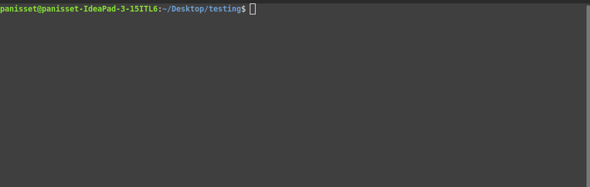
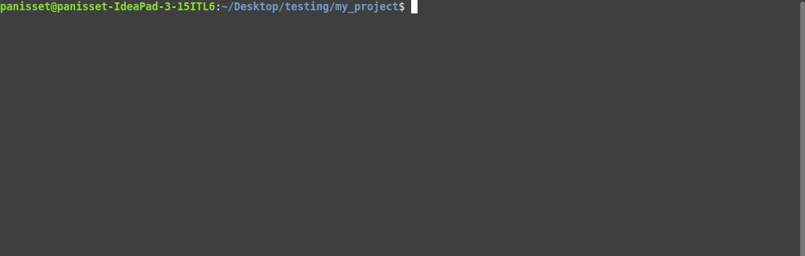
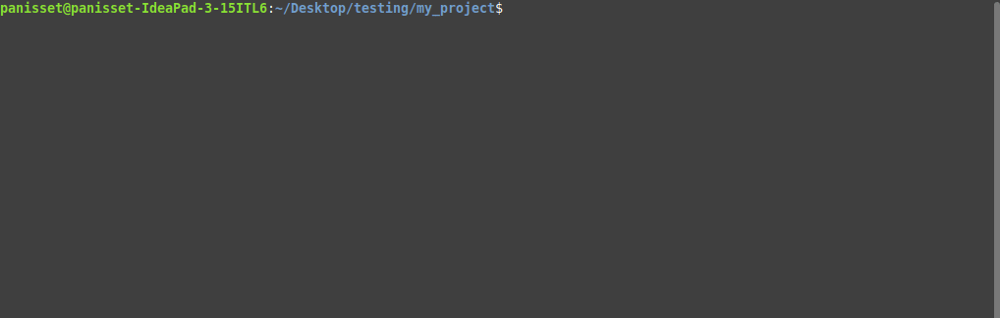
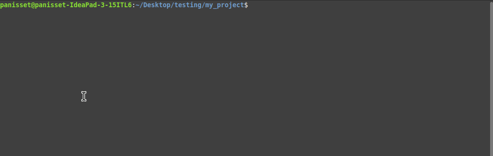

# A simplified version control system

The Goku repository management system is a command-line tool for managing Git-like repositories. It provides basic features for initializing, adding, committing, and diffing files in a repository.

## Installation

To install the Goku repository management system, follow these steps:

1. **Clone the repository:**

    ```sh
    git clone https://github.com/RafaelPanisset/GokuGit.git
    ```

## Configuration

To configure the Goku tool for easier access, you can create a symbolic link:

1. **Create a symbolic link:**

    ```sh
    ln -s /path/to/goku/installation/goku /usr/local/bin/goku
    ```

    Replace `/path/to/goku/installation/goku` with the actual path where Goku is installed.

## Features

* Initialize a new Goku repository
* Add files to the repository
* Commit changes to the repository
* Show the status of the repository (untracked, added, and modified files)
* Show the differences between the index and working directory

### `goku init`

Initialize a new Goku repository in the specified directory.




### `goku add <file_name>`

Add a file to the repository.



### `goku commit -m <message>`

Commit changes to the repository with the specified message.




### `goku status`

Show the status of the repository, including untracked, added, and modified files.



### `goku diff`

Show the differences between the index and working directory.


## Future Improvements

Here are some planned features and improvements:

1. **Branch Management:**
   - Create, list, and switch branches.
   - Merge branches.

2. **Remote Repositories:**
   - Push to and pull from remote repositories.
   - Clone remote repositories.

